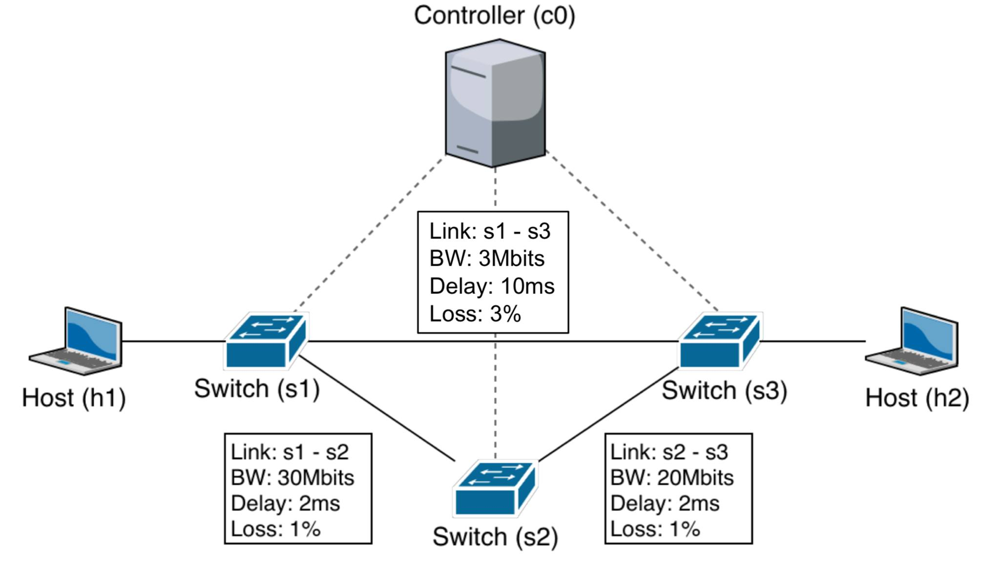
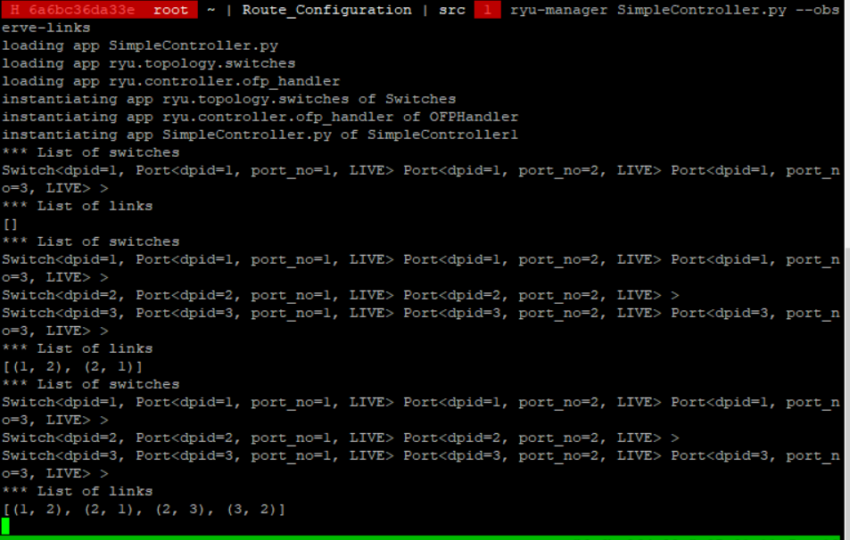

# Route Configuration

This repository is a lab for NCTU course "Introduction to Computer Networks 2018".

---
## Abstract

In this lab, we are going to write a Python program with Ryu SDN framework to build a simple software-defined network and compare the different between two forwarding rules.

---
## Objectives

1. Learn how to build a simple software-defined networking with Ryu SDN framework
2. Learn how to add forwarding rule into each OpenFlow switch

---
## Execution

> TODO:
> * How to run your program?
> * What is the meaning of the executing command (both Mininet and Ryu controller)?
> * Show the screenshot of using iPerf command in Mininet (both `SimpleController.py` and `controller.py`)

---
## Description

### Tasks

1. Environment Setup
    * Step 1: Join this lab on GitHub Classroom and get initial repository
    * Step 1.5: Clone repository outside of container, in own computer.  
    Do this for easier editing of README.md.
        ```
        git clone https://github.com/nctucn/lab3-baili0411.git
        Move into folder
        git checkout -b Readme
        ```
    * Step 2: Login in to container using SSH.  
    Access the container. Login as root. Didn't change the password.
    * Step 3: Clone your Github repository and setup Git in the container.  
    First, setup global username and email  
        ```
        git config --global user.name "Baili Deng"
        git config --global user.email "rayman0411@gmail.com"
        ```  
        Then clone Github repository.
        ```
        git clone https://github.com/nctucn/lab3-baili0411.git Route_Configuration
        ```
    * Step 4. Run Mininet for testing
        ```
        sudo mn
        mn
        ```
        
        ```
        sudo service oepenvswitch-switch start
        mn
        ```
        

2. Example of Ryu SDN
    * Step 1. Login to your container in two terminals
    Used tmux and create a new panel.
        ```
        tmux
        ```
    * Step 2. Run Mininet topology  
    Run SimpleTopo.py in one panel.  
        ```
        cd Route_Configuration/src
        mn --custom SimpleTopo.py --topo topo --link tc --controller remote
        ```
        Result after running SimpleTopo.py  
        --custom means we run mn, and invoke the "topo" topology constructor, the "tc" link constructor, and the "remote" controller constructor in SimpleTopo.py
    
    * Step 3. Run SimpleController.py in another terminal
    Switch the pane.
    Run SimpleController.py
        ```
        cd Route_Configuration/src
        ryu-manager SimpleController.py --observe-links
        ```
        ryu-mangager --observerlinks means that we observe link discovery events.  
        Result after running SimpleController.py
        
    * Step 3. Leave Ryu controller  
    Leave mininet first.
        ```
        mininet>exit
        ```
        Switch Panel over to Ryu controller, and stop it with Ctrl-z.
        Switch back to mininet panel, and clean links.
        ```
        mn -c
        ```
3. Mininet Topology
    * Step 0. Create a new branch for adding the topology.
    Create a new branch and move to it.
        ```
        git checkout -b topology
        ```
    * Step 1. Build the topology via Mininet
    Build the topology based on topo.
    
    Copy a topo.py based on SimpleTopo.py
        ```
        cp SimpleTopo.py topo.py
        ```
        After checking SimpleTopo.py, the parts we need to add are:  
        * Although there isn't a controller c0 added in the SimpleTopo.py, based on the result of executing SimpleTopo.py with mininet, there is a controller c0, so no need to add that.
        * Bandwidth, delay loss on links s1-s3, s1 -s2, s2-s3
        ```
        self.addLink(s1, s3, port1=3, port2=2, bw = 3, delay = '10ms', loss = 3)          
        self.addLink(s1, s2, port1=2, port2=1, bw = 30, delay = '2ms', loss = 1)          
        self.addLink(s3, s2, port1=3, port2=2, bw = 20, delay = '2ms', loss = 1) 
        ```
    * Step 2. Run Mininet topology and controller
        Run topo.py first in one panel
        ```
        mn --custom topo.py --topo topo --link tc --controller remote
        ```
        
        Then run SimpleController.py in another panel.
        ```
        ryu-manager SimpleController.py --observe-links
        ```
        
4. Ryu Controller
    * Step 1. Trace the code of Ryu controller  
        ```
        class SimpleController1(app_manager.RyuApp):
        ```
        Our SimpleController1 class inherits from app_manager.RyuApp.
        ```
        def __init__(self, *args, **kwargs):
            super(SimpleController1, self).__init__(*args, **kwargs)
            self.topology_api = self
            self.mac_to_port = {}
            self.net = nx.DiGraph()
            self.nodes = {}
            self.links = {}
        ```
        Initalization of class.  
        super(SimpleController1, self).__init__(*args, **kwargs) means that we use SimpleController1's parent class's __init__.  
        The reset of the lines are just initalizing the other things of the class with clean bases, such as empty python dictionaries, or in the case of self.net, a base directed graph in NetworkX.
        ```
        def add_flow(self, datapath, priority, match, actions):
        ```
        Note that there is no decoration for Ryu, and this function is only called by other functions in the function.  
        ```
        ofproto = datapath.ofproto
        parser = datapath.ofproto_parser      
        ```
        Obtain the protocol and parser OpenFlow and Ryu negotiated of a switch.  
        ```
        inst = [parser.OFPInstructionActions(ofproto.OFPIT_APPLY_ACTIONS, actions)]
        ```
        inst is a OpenFlow action instruction of type OFPIT_APPLY_ACTIONS under the current protocol, so it applies the actions from the action list, with the action list being "actions", the actions passed in from the function.
        ```
        mod = parser.OFPFlowMod(
            datapath=datapath,
            priority=priority,
            match=match,
            instructions=inst,
            command=ofproto.OFPFC_ADD,
            idle_timeout=0,
            hard_timeout=0,
            cookie=0)
        ```
        mod is a OpenFlow Modify Flow message, used to modify the flow table.  
        We set the datapath, priority by using the datapath and priority passed in the function.  

        match is a flow match defined using arguments. Here, we use the match passed in through the function.  

        instructions is the list of instructions used in the message, we use the inst we defined before.  

        Setting command to ofproto.OFPFC_ADD means that we add this flow to the flow table.  

        idle_timeout and hard_timeout are the idle time and max time before discarding, respectively.  

        Cookie is a controller-issued identifier.

        ```
        datapath.send_msg(mod)
        ```
        We send the OpenFlow message we defined and add an entry to the flow table of the switch.

        ```
        @set_ev_cls(ofp_event.EventOFPSwitchFeatures, CONFIG_DISPATCHER)
        def switch_features_handler(self, ev):
        ```
        The decorator means that this is now an event handler, and triggers when we get a features reply message from OpenFlow.  
        CONFIG_DISPATCHER means that this function is only called when receiving SwitchFeatures messages.
        ```
        msg = ev.msg
        datapath = msg.datapath
        ofproto = datapath.ofproto
        parser = datapath.ofproto_parser
        ```
        msg gets packet_in info from ev.msg.
        We set the router as obtained from msg.datapath.
        Then, we obtain the protocol and parser from datapath.
        ```
        match = parser.OFPMatch()
        actions = [parser.OFPActionOutput(ofproto.OFPP_CONTROLLER, ofproto.OFPCML_NO_BUFFER)]
        self.add_flow(
            datapath=datapath,
            priority=0,
            match=match,
            actions=actions)
        ```
        OFPMatch() means that our match gets packets with and without a VLAN tag.
        Our actions contains a action that sends a packet to the controller(because of ofproto.OFPP_CONTROLLER) created by parser.OFPActionOutput.  
        OFPCML_NO_BUFFER is a constant, which means that this packet will be added to the packet-in message instead of saving to the OpenFlow buffer.
        We then use these information and call add_flow to add the flow.

        The following two parts are mainly the same structure, but slightly different depending on the switch and the flows we want to create.

        ```
        if msg.datapath.id == 1:
        ```
        Check the id of the switch and determine what flows we should add to it.

        This is one example of a flow
        ```
         match = parser.OFPMatch(
                in_port=1,
                eth_type=0x0800,
                ipv4_src="10.0.0.1",
                ipv4_dst="10.0.0.2",
                ip_proto=17,
                udp_dst=5566)
            actions = [parser.OFPActionOutput(3)]
            self.add_flow(
                datapath=datapath,
                priority=3,
                match=match,
                actions=actions)
        ```
        match is created by the OFPMATCH, with the arguments defined int.
        The action is created by OFPActionOutput, which we send a packet to port 3.
        we then call add_flow to add the flow.  
        The other flows are created similarly.

        ```
        @set_ev_cls(ofp_event.EventOFPPacketIn, MAIN_DISPATCHER)
        def packet_in_handler(self, ev):
        ```
        The decorator means that this is now an event handler, and triggers when we get a packet in message.
        MAIN_DISPATCHER means this function is called when negotiation is finished.
        ```
        msg = ev.msg
        datapath = msg.datapath
        ofproto = datapath.ofproto
        in_port = msg.match['in_port']
        ```
        Get packet_in info from ev.msg.  
        get router from msg.datapath.  
        Get protocol from datapath.ofproto.  
        Get switch input port from msg.
        ```
        pkt = packet.Packet(msg.data)
        ```
        Create a packet class object pkt from msg.data.
        ```
        # Get the source and the destination ethernet address
        eth = pkt.get_protocol(ethernet.ethernet)
        eth_dst = eth.dst
        eth_src = eth.src
        ```
        pkt.get_protocol gets the first protocol in pkt that matches ethernet.ethernet, and we obtain an ethernet protocol.
        We then record the destination and source.
        ```
        dpid = datapath.id
        self.mac_to_port.setdefault(dpid, {})
        if eth_src not in self.net:
            self.net.add_node(eth_src)
            self.net.add_edge(dpid, eth_src, port=in_port)
            self.net.add_edge(eth_src, dpid)
        ```
        We then check the switch's id.
        If the switch doesn't exist in our mac_to_port dictionary, then we add dpid as index and {} as key.
        If eth_src is not found in the self.net directed graph, we add the node eth_src, and created edges from dpid to eth_src, and eth_src to dpid. Since this is a pakcet_in, we know the input port, so we set the port.
        ```
        if eth_dst in self.net:
            path = nx.shortest_path(self.net, eth_src, eth_dst)  
            next = path[path.index(dpid) + 1]
            out_port = self.net[dpid][next]['port']
        else:
            out_port = ofproto.OFPP_FLOOD
        ```
        Since we received a packet, we want to know where to send the packet next.  
        If the destination is in our network graph, we calculate the shortest path, find out what is the next node we should go to from our current switch, and set the output port to the coressponding port from our current switch to the next node.  
        If we don't know where the destination is (which means that it isn't in our graph, and we don't know it's mac address), we then send to all output ports, hoping to find a connection to it.

        ```
        match = datapath.ofproto_parser.OFPMatch(
            in_port=in_port,
            eth_dst=eth_dst)
        actions = [datapath.ofproto_parser.OFPActionOutput(out_port)]
        if out_port != ofproto.OFPP_FLOOD:
            self.add_flow(
                datapath=datapath,
                priority=1,
                match=match,
                actions=actions)
        out = datapath.ofproto_parser.OFPPacketOut(
            datapath=datapath,
            in_port=in_port,
            actions=actions,
            buffer_id=msg.buffer_id)
        datapath.send_msg(out)
        ```
        Create a match for matching in_port and eth_dst, and the actions are to send a packet to out_port.  
        If we know where to send the packet next (which means we aren't flooding), we add a flow table entry.
        OFPPacketOut creates a message that sends the packet out. We set the router, input port, the actions, and the id.  
        Finally, we send the message, and ask the router to send the packet.  
        Note that the reason creating a flow avoids packet-in is that if the flow is created, the packet will just be sent based on the flow.

        ```
        @set_ev_cls(event.EventSwitchEnter)
        def get_topology_data(self, ev):
        ```
        This method is called with a EventSwitchEnter event.
        ```
        switches_list = get_switch(self.topology_api, None)  
        switches = [switch.dp.id for switch in switches_list]
        self.net.add_nodes_from(switches)
        print('*** List of switches')
        for switch in switches_list:
            print(switch)
        ```
        We get the list of switches connected to controller from our topology_api.  
        we created a list of switch ids, and then add these as nodes in our network.  
        We then print the switches.

        ```
        links_list = get_link(self.topology_api, None)
        links = [(link.src.dpid, link.dst.dpid, {'port': link.src.port_no}) for link in links_list]
        self.net.add_edges_from(links)
        links = [(link.dst.dpid, link.src.dpid, {'port': link.dst.port_no}) for link in links_list]
        self.net.add_edges_from(links)
        print('*** List of links')
        print(self.net.edges())
        ```
        We get the list of links from our topology_api.
        We create a list of edges to add to the network, by adding all the links, and using their source switch's id and the destination switch's id. The links are in both directions.
        We then print out all of these edges.

    * Step 2:Write another Ryu controller  
        Duplicate SimpleController.py and call name it controller.py.
        ```
        cp SimpleController.py controller.py
        ```
        Only modify switch_features_handler.
        We need to change paths to:  
        h1 -> s1 -> s3 -> h2  
        h2 -> s3 -> s2 -> s1 -> h1 
        ```
        # Add forwarding rule in s1
        if msg.datapath.id == 1:
            # For h1-h2 flow: h1 -> s1 -> s3
            match = parser.OFPMatch(
                in_port=1,
                eth_type=0x0800,
                ipv4_src="10.0.0.1",
                ipv4_dst="10.0.0.2",
                ip_proto=17,
                udp_dst=5566)
            actions = [parser.OFPActionOutput(3)]
            self.add_flow(
                datapath=datapath,
                priority=3,
                match=match,
                actions=actions)
            # For h2-h1 flow: s2 -> s1 -> h1
            match = parser.OFPMatch(
                in_port=2,
                eth_type=0x0800,
                ipv4_src="10.0.0.2",
                ipv4_dst="10.0.0.1",
                ip_proto=17,
                udp_dst=5566)
            actions = [parser.OFPActionOutput(1)]
            self.add_flow(
                datapath=datapath,
                priority=3,
                match=match,
                actions=actions)
            
        # Add forwarding rule in s3
        if msg.datapath.id == 3:
            # For h2-h1 flow: h2 -> s3 -> s2
            match = parser.OFPMatch(
                in_port=1,
                eth_type=0x0800,
                ipv4_src="10.0.0.2",
                ipv4_dst="10.0.0.1",
                ip_proto=17,
                udp_dst=5566)
            actions = [parser.OFPActionOutput(3)]
            self.add_flow(
                datapath=datapath,
                priority=3,
                match=match,
                actions=actions)
            # For h1-h2 flow: s1 -> s3 -> h2
            match = parser.OFPMatch(
                in_port=2,
                eth_type=0x0800,
                ipv4_src="10.0.0.1",
                ipv4_dst="10.0.0.2",
                ip_proto=17,
                udp_dst=5566)
            actions = [parser.OFPActionOutput(1)]
            self.add_flow(
                datapath=datapath,
                priority=3,
                match=match,
                actions=actions)

        # Add forwarding rule in s2
        if msg.datapath.id == 2:
            # For h2-h1 flow: s3 -> s2 -> s1
            match = parser.OFPMatch(
                in_port=2,
                eth_type=0x0800,
                ipv4_src="10.0.0.2",
                ipv4_dst="10.0.0.1",
                ip_proto=17,
                udp_dst=5566)
            actions = [parser.OFPActionOutput(1)]
            self.add_flow(
                datapath=datapath,
                priority=3,
                match=match,
                actions=actions)
        ```

5. Measurement

### Discussion

> TODO:
> * Answer the following questions

1. Describe the difference between packet-in and packet-out in detail.
   
2. What is “table-miss” in SDN?
   
3. Why is "`(app_manager.RyuApp)`" adding after the declaration of class in `controller.py`?
   
4. Explain the following code in `controller.py`.
    ```python
    @set_ev_cls(ofp_event.EventOFPPacketIn, CONFIG_DISPATCHER)
    ```

5. What is the meaning of “datapath” in `controller.py`?
   
6. Why need to set "`ip_proto=17`" in the flow entry?
   
7. Compare the differences between the iPerf results of `SimpleController.py` and `controller.py` in detail.
   
8. Which forwarding rule is better? Why?

---
## References

* **Ryu SDN**
    * [Ryu Documentation](https://ryu.readthedocs.io/en/latest/index.html)
    * [Ryu SDN Framework Documentation](https://osrg.github.io/ryu-book/zh_tw/html/)
* **Mininet**
    * [Introduction to Mininet](https://github.com/mininet/mininet/wiki/Introduction-to-Mininet)
* **Others**
    * [Cheat Sheet of Markdown Syntax](https://www.markdownguide.org/cheat-sheet)
    * [Git Setup Guide](https://git-scm.com/book/zh-tw/v2/%E9%96%8B%E5%A7%8B-%E5%88%9D%E6%AC%A1%E8%A8%AD%E5%AE%9A-Git)
    * [Tmux shortcuts and cheatsheat](https://gist.github.com/MohamedAlaa/2961058)

---
## Contributors

* [Baili Deng](https://github.com/baili0411)
* [David Lu](https://github.com/yungshenglu)

---
## License

GNU GENERAL PUBLIC LICENSE Version 3